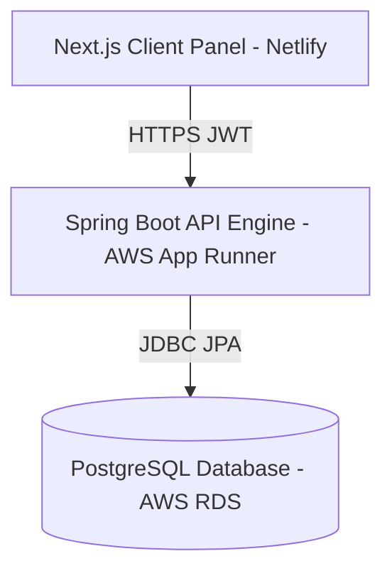

# SecureAccess: Role-Based Data Access Governance Platform

SecureAccess is a portfolio-grade, fine-grained data access governance platform designed to control, evaluate, and audit access to enterprise data resources. 

Unlike simple row-level database permissions or generic CRUD security, SecureAccess implements a centralized, declarative **Policy Evaluation Engine** featuring deny-wins precedence, permission inheritance, and fully explainable trace logging.

---

## Architecture & Deployment Model

SecureAccess is structured as a decoupled full-stack application. It can be run locally using Docker Compose or deployed in production on AWS:



### Local Development Architecture
- **Frontend**: Next.js 15 App Router, styled with Tailwind CSS v4, utilizing Lucide SVG icons. Serves on port `3000`.
- **Backend**: Spring Boot 3.4 API Engine, utilizing Spring Security, Hibernate JPA, and JSON Web Tokens (JWT). Serves on port `8080`.
- **Database**: PostgreSQL 16 (for persistent storage) or H2 (for zero-install in-memory local runs).

---

## Core Security & Policy Semantics

The platform enforces access controls according to three core principles:
1. **Default-Deny (Closed World Assumption)**: Access is blocked unless an explicit matching policy allows it.
2. **Deny-Wins-on-Conflict**: If multiple policies match a request, any policy with a `DENY` permission immediately overrides all other `ALLOW` policies.
3. **Capability Inheritance (WRITE implies READ)**: If a role has `WRITE` permission on a resource, it automatically possesses implicit `READ` capabilities.
4. **Explainable Audit Trace**: Every access request publishes an event asynchronously to write an immutable, compliance-ready log entry. This log specifies the evaluating actor, sensitivity category, final decision, and a step-by-step reason.

---

## API Overview

### Authentication (Public)
- `POST /api/auth/register` — Create a new account with select roles (`ADMIN`, `EDITOR`, `VIEWER`).
- `POST /api/auth/login` — Sign in and receive a stateless HS256 JWT token.

### Admin Governance Panel (Protected: `ADMIN` only)
- `GET /api/admin/resources` — Retrieve cataloged data assets.
- `POST /api/admin/resources` — Register a new data asset with owner and sensitivity class (`PUBLIC`, `INTERNAL`, `CONFIDENTIAL`, `RESTRICTED`).
- `DELETE /api/admin/resources/{id}` — Delete a registered resource.
- `GET /api/admin/policies` — List configured policy mappings.
- `POST /api/admin/policies` — Map a `Role` to a `Resource` with a `Permission` (`READ`, `WRITE`, `DENY`) and an optional condition.
- `DELETE /api/admin/policies/{id}` — Remove a policy.
- `GET /api/admin/audit/logs` — Fetch paginated, filterable compliance logs.
- `GET /api/admin/audit/stats` — Retrieve high-level evaluation stats (allowed checks, deny rates, etc.).

### Policy Evaluation
- `POST /api/access/check` — Check access for the current logged-in user context.
- `POST /api/access/admin/check?userId=...` (Admin Only) — Perform policy evaluation for any user in the system.

---

## Local Setup & Run Guide

### Option 1: Complete Full Stack via Docker (Recommended)
Launch the entire system (PostgreSQL + Spring Boot Backend + Next.js Frontend) with a single command:
```bash
docker-compose up --build
```
- Open **Frontend Console**: `http://localhost:3000`
- Open **Backend Swagger UI**: `http://localhost:8080/swagger-ui.html`

### Option 2: Running Locally in Development Mode
#### 1. Backend (with In-Memory H2 DB)
Navigate to the `/backend` folder and run the Spring Boot API:
```bash
./mvnw spring-boot:run -Dspring-boot.run.profiles=h2
```
- The backend will launch on `http://localhost:8080` with the H2 web console accessible at `http://localhost:8080/h2-console` (JDBC URL: `jdbc:h2:mem:secureaccess_db`, username: `sa`, password: `sa`).

#### 2. Frontend Next.js Client
Navigate to the `/frontend` folder, install dependencies, and start the development server:
```bash
npm install
npm run dev
```
- Open `http://localhost:3000` to interact with the console dashboard.

---

## Key Design Decisions

- **Stateless JWT with LocalStorage**: We chose stateless JWT authentication to accommodate distributed production nodes (like AWS App Runner). We stored tokens in `localStorage` for cross-domain accessibility (Netlify to App Runner) and simple token inspection via Swagger.
- **Event-Driven Auditing**: Auditing is asynchronous and decoupled from the main policy checker. Publishing a Spring `ApplicationEvent` ensures that audit logging operations never delay policy evaluation times (&lt; 5ms).
- **Default-Deny and Deny-Wins**: Essential for compliance (SOC2/HIPAA). Security models must fail-safe; if policy configurations conflict, blocking access is the safest default behavior.
- **AWS App Runner + RDS**: We preferred AWS App Runner over complex ECS/Fargate clusters for its zero-ops auto-scaling, integrated SSL, and simplified environment-variable management, which maps cleanly to our environment-driven configuration.

---

## Production Gaps & Limitations

While SecureAccess features a portfolio-ready implementation, it has the following production limitations:
1. **Simplified Policy Expressions**: Policy conditions (e.g. `owner_only`) are evaluated as simple string checks rather than using a dynamic expression parser like Spring Expression Language (SpEL) or Open Policy Agent (OPA) Rego.
2. **Fixed Enum Roles**: Roles are defined as a compiled Java Enum (`ADMIN`, `EDITOR`, `VIEWER`). A dynamic RBAC system would store roles as custom DB entities to support runtime creation of custom roles.
3. **In-Memory JWT Blacklisting**: Token invalidation (like on logout or password changes) is not implemented. A production environment would use a Redis cluster to store blacklisted token signatures.